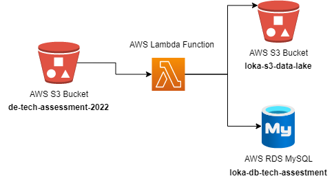
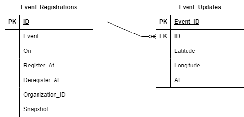

# Documentation
## Loka Assestment

### Description

This repository contain a solution of the Data Engineer Tech Assestment of Loka company.
For this exercise, I didn't create the Lambda functions to avoid being charge for the CPU utilization.
#### Sequence Diagram
This is how I designe this solution. As I mentioned above, I didn't create the Lambda functions to avoid possible billings on AWS, but the approach would be like the following Sequence Diagram.

### Database Diagram

## Install

    pip install --upgrade pip
    pip install -r requirements.txt

## Code Documentation

### AWS Files

#### aws_models.py
This file contains the AWSConnection which handle the connection with AWS.
Contains 5 functions:
- get_file_s3_bucket(filename: str): This function retrieves all the files in a specific S3 Bucket
- list_object_s3_bucket(): This function return a list with the name of all the files
- list_sorted_object_s3_bucket(prefix: str): this function return a list with all files name sorted (built for this solution due to all the files contains Y-m-d-H-M-S structure)
- move_files_to_a_s3(s3_bucket_from: str, source_filename: str, s3_bucket_to: str, target_filename: str): This function allow to copy and store files from one S3 bucket to another.

#### s3_bucket_creation.py
This file allow to create a new S3 Bucket.

### ORM - Database files. MySQL

#### database_connection_model.py
This file contain the SQLconnection class that generate the connectrion string for the MySQL DB. For future improvement, by having this class you can change/add new connection string if the database is going to change.

#### database.py
This file contain the engine that allow the connection with the DB.

#### models.py
This files contains the model classes that allow to perform the task requested.
Classes:
- EventRegistration: This class allow to initialize each instance of registration. Also, with SQLAlchemy each field of the table is defined.
- EventUpdate: This class allow to initialize each instance of updates for each ID.Also, with SQLAlchemy each field of the table is defined.
- Register: Class that allow to store the register_at date.
- Deregister: Class that allow to store the deregister_at date.

#### logic.py
This file consolidate all the logic to pull the files from the S3 Bucket (Data Lake) created and store the values on the DB.

#### config.py
This file contains all the variables needed to perform this task. * of course the .env was uploaded because contains secrets, in case that is needed to test the code, please let me know: gomezmonroyfederico@gmail.com

